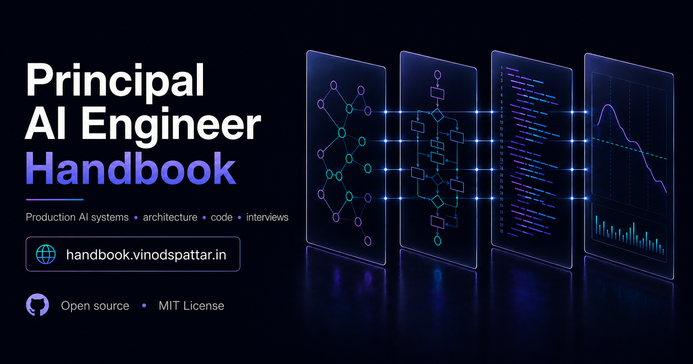

# Principal AI Engineer Handbook



[](https://github.com/vins13pattar/principal-ai-engineer-handbook/actions/workflows/site-ci.yml)
[](https://github.com/vins13pattar/principal-ai-engineer-handbook/actions/workflows/lab-async-ai-gateway-ci.yml)
[](LICENSE)

A reference for engineers working on production AI systems — reference architectures, labs you can
run, and interview material grounded in both. Written for Principal and Staff AI Engineers, AI
Platform Engineers, AI Architects, and Founding AI Engineers.

It covers a small number of systems in depth and looks at each from four angles: the concepts
behind it, a design review of it, running code for it, and the interview round where it comes up.
Those four are cross-linked, so a topic can be read in either direction — from the idea to the
code, or from the code back to the reasoning.

**[Read the handbook →](https://handbook.vinodspattar.in/)** · New here?
[Start here](https://handbook.vinodspattar.in/start-here/) explains which section to open and when.

## What's here

| Section                                                        | What it is                                                          |
| -------------------------------------------------------------- | ------------------------------------------------------------------- |
| [Learn](https://handbook.vinodspattar.in/learn/)               | Sixteen modules, Principal Engineer mindset through agent identity  |
| [Build](https://handbook.vinodspattar.in/build/)               | Production-quality labs in [`labs/`](labs/)                         |
| [Architecture](https://handbook.vinodspattar.in/architecture/) | Reference architectures for recurring AI infrastructure problems    |
| [Interview](https://handbook.vinodspattar.in/interview/)       | Interview questions embedded next to the material that answers them |
| [Reference](https://handbook.vinodspattar.in/reference/)       | One-page lookups for tools and primitives                           |
| [Decision Records](https://handbook.vinodspattar.in/adr/)      | Why the platform and its labs are built the way they are            |
| [Cheat Sheets](https://handbook.vinodspattar.in/cheatsheets/)  | Printable, one-page summaries                                       |
| [Roadmap](https://handbook.vinodspattar.in/roadmap/)           | Current version and what ships next                                 |

## Status

**Sixteen Learn modules, ten labs, seven architecture pages, three interview tracks, thirteen
reference lookups, five cheat sheets.** Seven of the ten labs have a matching architecture page;
the three newest have a module and a Build page but no design review yet. Every lab passes `ruff`,
`mypy --strict`, and its own test suite in CI.
The [Roadmap](https://handbook.vinodspattar.in/roadmap/) says what does not exist yet, and is kept
honest by a linter that fails the build when a page is missing a required section — or when a page
on a fast-moving topic goes unverified past its review window.

## Repository structure

```text
apps/handbook/       Astro + Starlight documentation site
packages/ui/         Brand design tokens (Tailwind v4 theme)
packages/components/ Reusable MDX doc components
packages/diagrams/   Client-side Mermaid diagram component
packages/shared/     Content schemas, versioning types, structural content linter
labs/                Production-quality labs (independent Python projects)
docs/                Contributor-facing guides (content authoring, local development)
scripts/             Repo-level tooling (content structure lint)
.github/workflows/   CI (lint, typecheck, test, build, e2e) — deployment is Cloudflare, not Actions
```

## Local development

```bash
pnpm install
pnpm dev      # http://localhost:4321
```

See [`docs/DEVELOPMENT.md`](docs/DEVELOPMENT.md) for the full command reference and
[`docs/CONTENT_GUIDE.md`](docs/CONTENT_GUIDE.md) for how to write a new page.

## Deployment

The site is a Cloudflare Worker serving static assets — no server code, no deploy step in
`.github/workflows/`. Every push to `main` and every pull request gets its own build.

The decisions behind that are published rather than buried, because they are the same kind of
decision the handbook argues about:
[ADR-0007](https://handbook.vinodspattar.in/adr/decisions/0007-workers-static-assets-deployment/)
covers why this is a Worker rather than a Pages project, and
[ADR-0005](https://handbook.vinodspattar.in/adr/decisions/0005-cloudflare-pages-deployment/) is the
decision it superseded, kept because a reversal is worth more than a clean record.
[`docs/DEVELOPMENT.md`](docs/DEVELOPMENT.md#deployment) has the project settings and the four ways
this configuration fails quietly.

## Contributing

See [`CONTRIBUTING.md`](CONTRIBUTING.md).

## License

[MIT](LICENSE)

## Author

**Vinod Pattar** — Principal Engineer, AI Platform & Full-Stack Architecture
